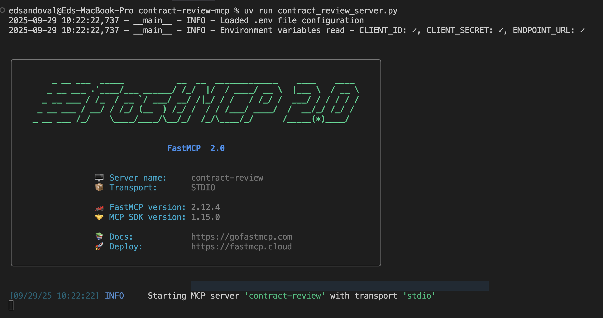
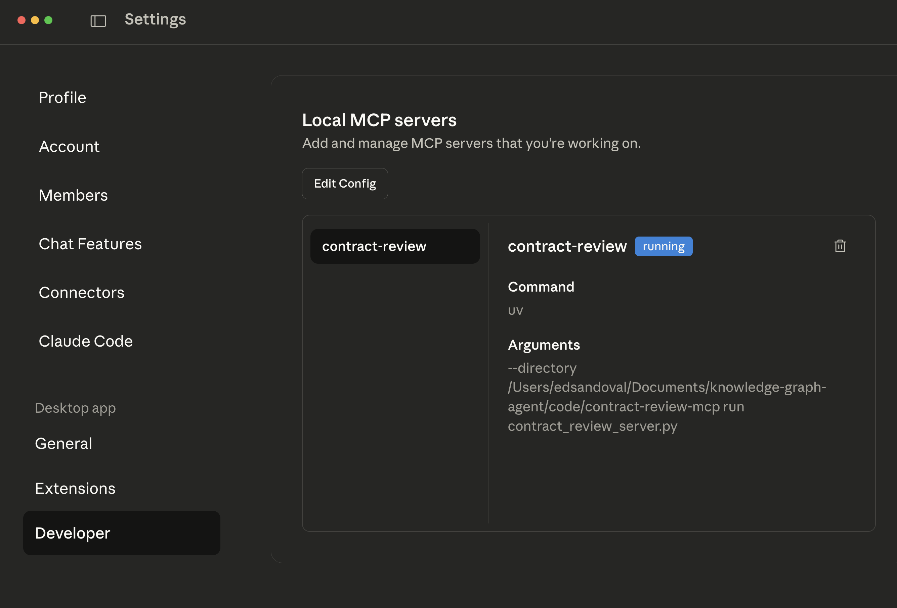
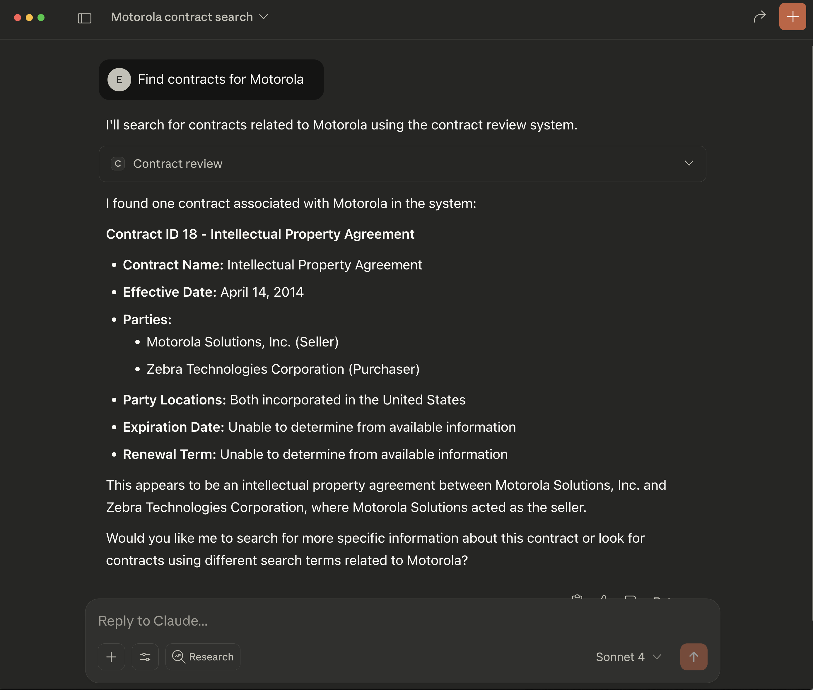

# Contract Review MCP Server

## Overview

This is a Local MCP Server for your agent. The `contract_review_server.py` demonstrates how the agent API endpoint can be wrapped into a local MCP server, making it accessible to Claude Desktop through the Model Context Protocol (MCP).

In the coming weeks, the agent will be available to be made external as a Remote MCP Server. In the meantime, the instructions below show how to create a simple Local MCP server for our contract review agent and test it in Claude.

## Setup Instructions

### Prerequisites
- Python 3.8+
- uv (Python package manager)
- Claude Desktop application

### Steps to Get Started

1. **Install dependencies and create virtual environment**
   ```bash
   uv sync
   ```

2. **Configure environment variables**
   - Copy `.env.example` to `.env`
   - Edit `.env` with your Aura API Key (client and secret) and agent endpoint

3. **Test the server**
   ```bash
   uv run contract_review_server.py
   ```
   This will start the MCP server and verify it's working correctly.
   

4. **Add local server to Claude Desktop configuration**
   
   Add the following configuration to your Claude Desktop config JSON file 

   ```json
   {
       "mcpServers": {
         "contract-review": {
           "command": "uv",
           "args": [
             "--directory",
             "<full_path_to_your_local_repo>knowledge-graph-agent/code/contract-review-mcp",
             "run",
             "contract_review_server.py"
           ]
         }
       }
   }
   ```

5. **Restart Claude Desktop**
   Close and reopen Claude Desktop to load the new MCP server configuration.
   Go to `Settings -> Developer` and confirm the new MCP server is running

   

6. **Test the integration**
   Ask Claude a question about contracts to verify the MCP server is working properly.
   ```
   Find contracts for Motorola
   ```
   

## Usage

Once configured, Claude will have access to the contract review agent's capabilities through the MCP server. You can ask questions about contracts, and Claude will use the agent's API endpoints to provide responses.

## Future Development

This local MCP server setup is a temporary solution. In the coming weeks, the agent will be available as a Remote MCP Server, which will simplify the setup process and provide enhanced functionality.
