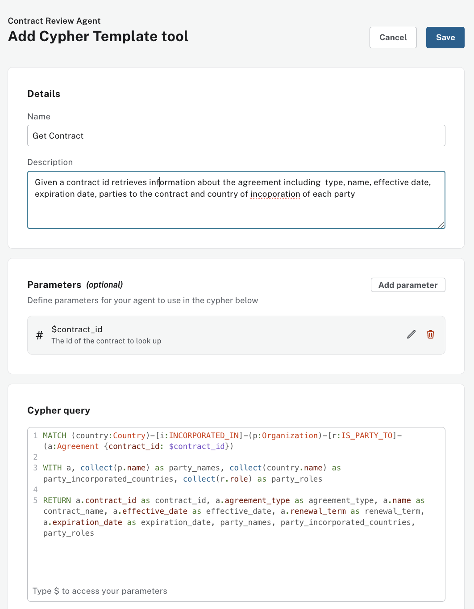
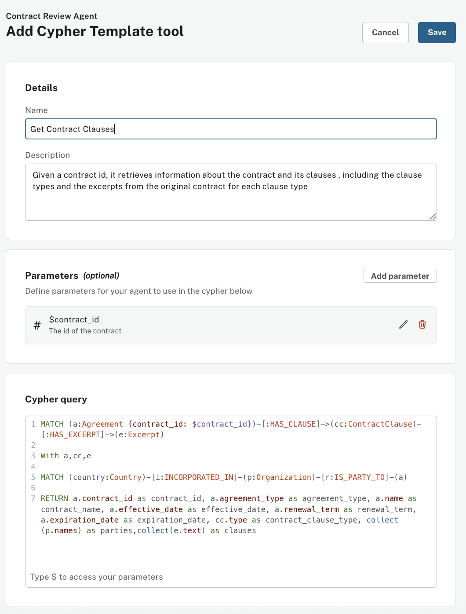
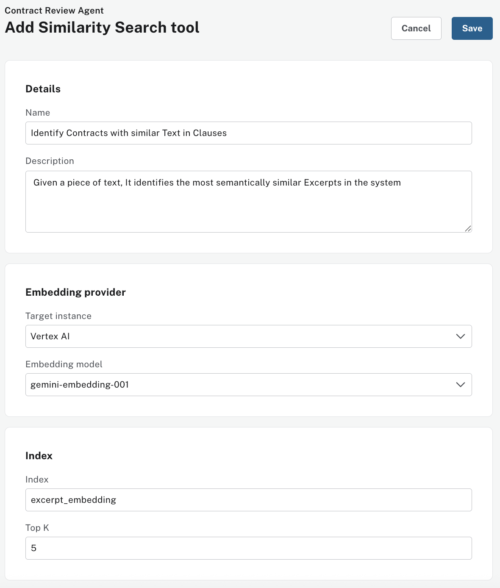
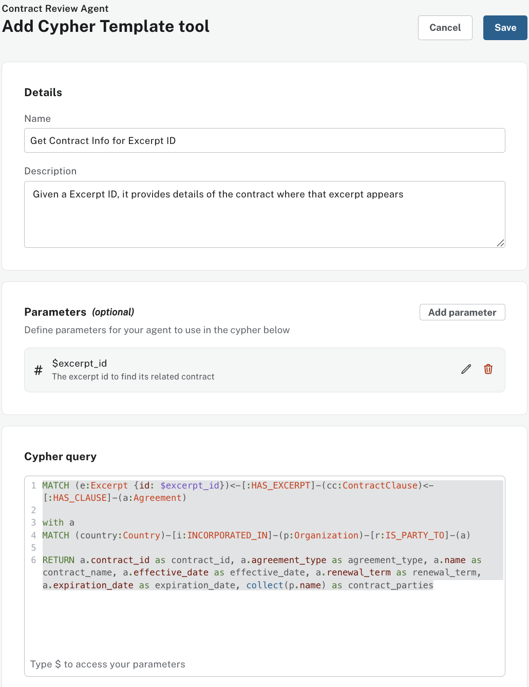
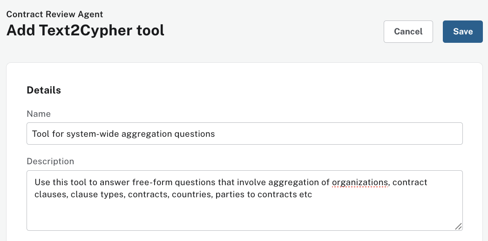
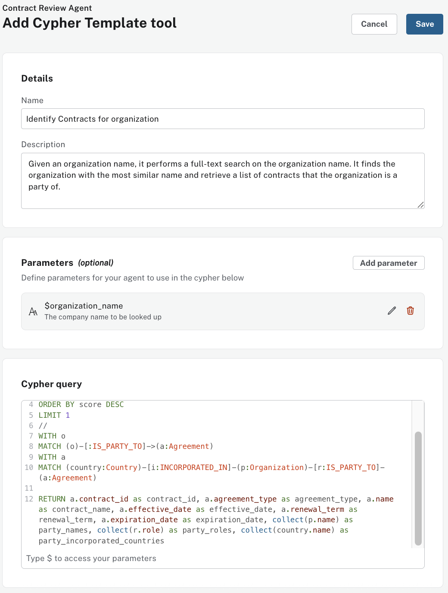

# A Contract Review Agent - Step-by-Step Guide

This guide walks you through creating a Commericial Contract Review agent for legal professionals using Neo4j's Aura Agents. This agent helps analyze contracts, identify key clauses, and assess risks.

## Step 1: Access Aura Console

1. Navigate to the **Aura Console**: [https://console-preview.neo4j.io/](https://console-preview.neo4j.io/)
2. Log in with your Aura credentials
3. Enable `Generative AI assistance` for your Aura Organization


## Step 2: Set Up The Database
Make sure you have a Neo4j AuraDB instance running. If you're new to AuraDB, create an account at https://console.neo4j.io and click Create Instance.

Wait until your instance is `"RUNNING"`


Using the "…​3 dots" menu in the Aura console, select `Backup & Restore`

Restore from [`contract-data.backup`](./dump/contract-data.backup) file (Located under `./dump/contract-data.backup`)

Wait until your instance goes back to `"RUNNING"`

### Allow Tools Authentication to connect to your Instance
- Go back to your Organization -> Security Settings 
- Activate `Allow tools to connect with permissions from the user's project role`
- Make your to select your `Contract DB instance`


## Step 3: Navigate to Agents

Within your Organization, `Open` your Aura project


1. In the Aura Console, locate the **Data Services** section


2. Click on **Agents**

## Step 3: Create Agent

Click on **Create Agent** and enter the following configuration:


### Agent Configuration

**Agent Name:**
```
Contract Review Agent
```

**Description:**
```
A legal contract review agent with access to a Neo4j knowledge graph for analyzing contracts, clauses, and legal risks.
```

**Prompt instructions:**
```
You are a Commercial Contract Review Agent, a specialized AI assistant for commercial contract analysis using a Knowledge Graph of multiple contracts. You are a Neo4j expert with excellent knowledge of Cypher and a paralegal expert who can help junior legal professionals answer important commercial contract review questions.

You have access to a comprehensive knowledge graph containing contract data, clauses. You can query this graph using tools and Cypher to help you get answers.

You can support legal professionals by:
- Identifying high-risk contracts with missing or problematic clauses
- Assessing risk factors and compliance issues across contract portfolios
- Finding contracts with similar clauses or terms for comparative analysis
- Identifying all contracts associated with specific organizations
- Providing paralegal-level guidance on contract review best practices
- Helping junior legal professionals understand complex contractual relationships

Your responses should be professional, accurate, and tailored to help legal professionals make informed decisions.
```

**Target Instance:** Choose your Neo4j instance from the dropdown


## Step 4: Add Tools

Click **Add Tools** configure the following tools:


### Tool 1: Get Contract

Add a `Cypher Template Tool`

**Name**
```
Get Contract
```

**Description:**
Given a contract id retrieves information about the agreement including type, name, effective date, expiration date, parties to the contract and country of incorporation of each party

**Parameters:**
- Name = `contract_id`. Type = `integer`. Description = `The id of the contract to look up`

**Cypher Query:**
```cypher
MATCH (country:Country)-[i:INCORPORATED_IN]-(p:Organization)-[r:IS_PARTY_TO]-(a:Agreement {contract_id: $contract_id})
WITH a, collect(p.name) as party_names, collect(country.name) as party_incorporated_countries, collect(r.role) as party_roles
RETURN a.contract_id as contract_id, a.agreement_type as agreement_type, a.name as contract_name, a.effective_date as effective_date, a.renewal_term as renewal_term, a.expiration_date as expiration_date, party_names, party_incorporated_countries, party_roles
```



**Click Save**

### Tool 2: Get Contract Clauses

Add a `Cypher Template Tool`

**Name**
```
Get Contract Clauses
```

**Description:**
Given a contract id, it retrieves information about the contract and its clauses, including the clause types and the excerpts from the original contract for each clause type

**Parameters:**
- Name = `contract_id`. Type = `integer`. Description = `The id of the contract`

**Cypher Query:**
```cypher
MATCH (a:Agreement {contract_id: $contract_id})-[:HAS_CLAUSE]->(cc:ContractClause)-[:HAS_EXCERPT]->(e:Excerpt)

With a,cc,e

MATCH (country:Country)-[i:INCORPORATED_IN]-(p:Organization)-[r:IS_PARTY_TO]-(a)

RETURN a.contract_id as contract_id, a.agreement_type as agreement_type, a.name as contract_name, a.effective_date as effective_date, a.renewal_term as renewal_term, a.expiration_date as expiration_date, cc.type as contract_clause_type, collect (p.names) as parties,collect(e.text) as clauses
```



**Click Save**

### Tool 3: Identify Contracts with Similar Text in Clauses

Add a `Similarity Search Tool`

**Name**
```
Identify Contracts with similar Text in Clauses
```

**Description:**
```
Given a piece of text, It identifies the most semantically similar Excerpts in the system
```

### Embedding Provider Section
**Embedding provider:**
```
Vertex AI
```

**Embedding Model:**
```
gemini-embedding-001
```

### Vector Index Section
**Index Name:**
```
excerpt_embedding
```
**Top K:**
```
5
```

**Click Save**


### Tool 4: Get Contract Info for Excerpt ID

Add a `Cypher Template Tool`

**Name**
```
Get Contract Info for Excerpt ID
```

**Description:**
```
Given a Excerpt ID, it provides details of the contract where that excerpt appears.
```

**Parameters:**
Name
```
excerpt_id
```
Type
```
integer
```
Description
```
The excerpt id to find its related contract.
```

**Cypher Query:**
```cypher
MATCH (e:Excerpt {id: $excerpt_id})<-[:HAS_EXCERPT]-(cc:ContractClause)<-[:HAS_CLAUSE]-(a:Agreement)

WITH a
MATCH (country:Country)-[i:INCORPORATED_IN]-(p:Organization)-[r:IS_PARTY_TO]-(a)

RETURN a.contract_id as contract_id, a.agreement_type as agreement_type, a.name as contract_name, a.effective_date as effective_date, a.renewal_term as renewal_term, a.expiration_date as expiration_date, collect(p.name) as contract_parties
```

**Click Save**

### Tool 5: Tool for system-wide aggregation questions

Add a `Text2Cypher Tool`

**Name**
```
Tool for system-wide aggregation questions
```

**Description:**
```
Use this tool to answer free-form questions that involve aggregation of organizations, contract clauses, clause types, contracts, countries, parties to contracts etc
```

**Click Save**

### Tool 6: Identify Contracts for organization

Add a `Cypher Template Tool`

**Name**
```
Identify Contracts for organization
```

**Description:**
```
Given an organization name, it performs a full-text search on the organization name. It finds the organization with the most similar name and retrieve a list of contracts that the organization is a party of.
```

**Parameters:**
Name
```
organization_name
```
Type
```
string
```
Description
```
The company name to be looked up
```

**Cypher Query:**
```cypher
CALL db.index.fulltext.queryNodes('organizationNameTextIndex', $organization_name)
YIELD node AS o, score
WITH o, score
ORDER BY score DESC
LIMIT 1
//
WITH o
MATCH (o)-[:IS_PARTY_TO]->(a:Agreement)
WITH a
MATCH (country:Country)-[i:INCORPORATED_IN]-(p:Organization)-[r:IS_PARTY_TO]-(a:Agreement)

RETURN a.contract_id as contract_id, a.agreement_type as agreement_type, a.name as contract_name, a.effective_date as effective_date, a.renewal_term as renewal_term, a.expiration_date as expiration_date, collect(p.name) as party_names, collect(r.role) as party_roles, collect(country.name) as party_incorporated_countries
```

**Click Save**

## Save Agent
Once all tools have been configured:

Click **Save Agent** to deploy your Contract Review Agent


## Test Agent

Your Contract Review Agent Agent is now ready to assist you.

Your agent should be able to answer the following lines of questioning

**Question 1**
```
How many contracts, clauses and organizations are there in the system?
```
**Question 2**
```
List the top 5 organizations with the most contracts
```
**Question 3**
```
Find contracts for Netgear
```
**Question 4**
```
For the most recent of these contracts, list their key clauses
```
**Question 5**
```
Suggest ways to improve the license grant clause
```

**Question 6**
```
Find contracts with clauses containing text similar to IP licensing expiration
```
**Question 7**
```
Find details about the Motorola contract, include its clauses
```
**Question 8**
```
highlight the pros and cons of the change of control clause
```

