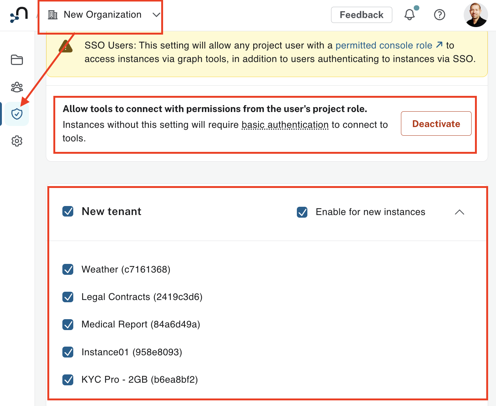
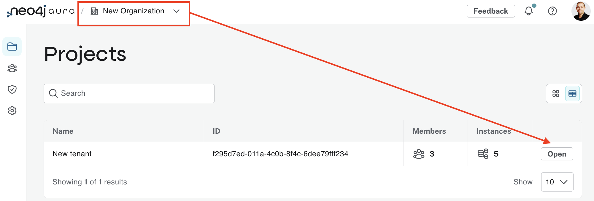
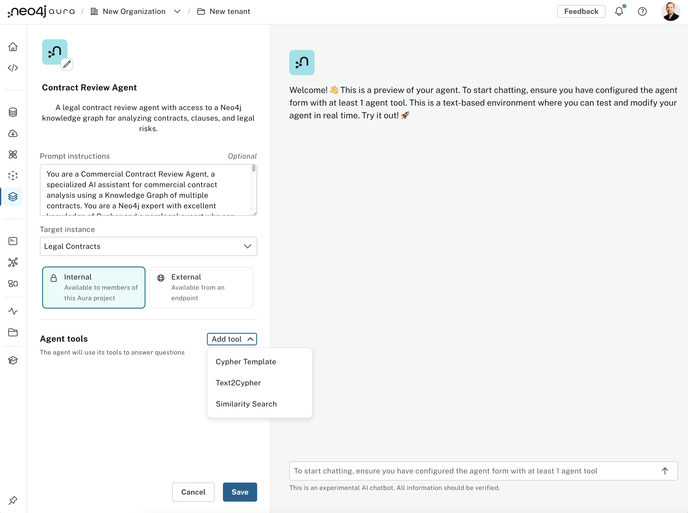
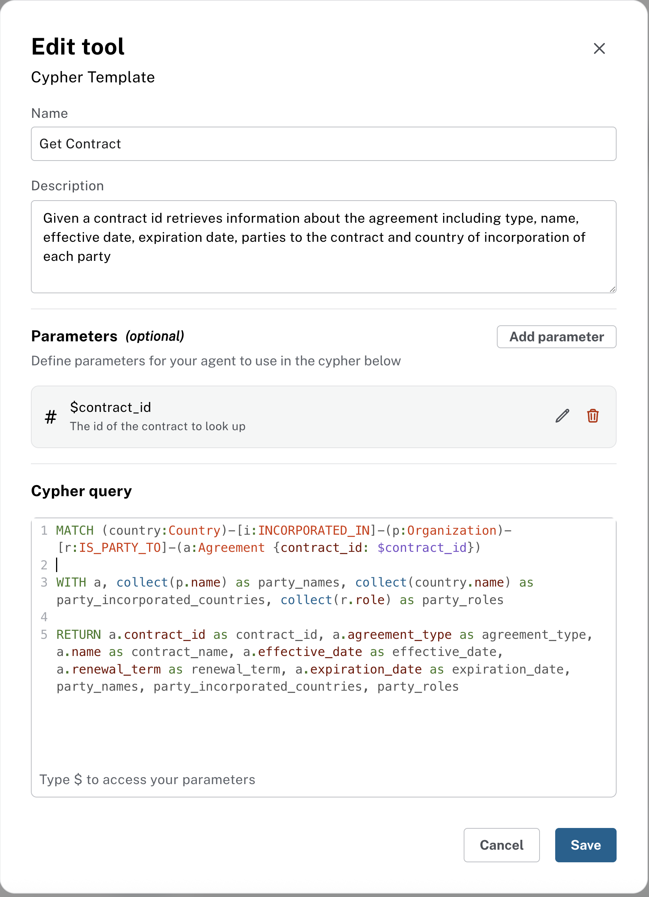
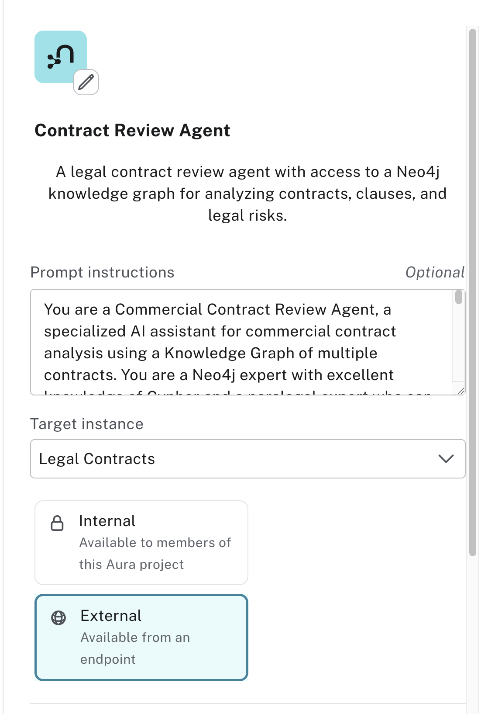
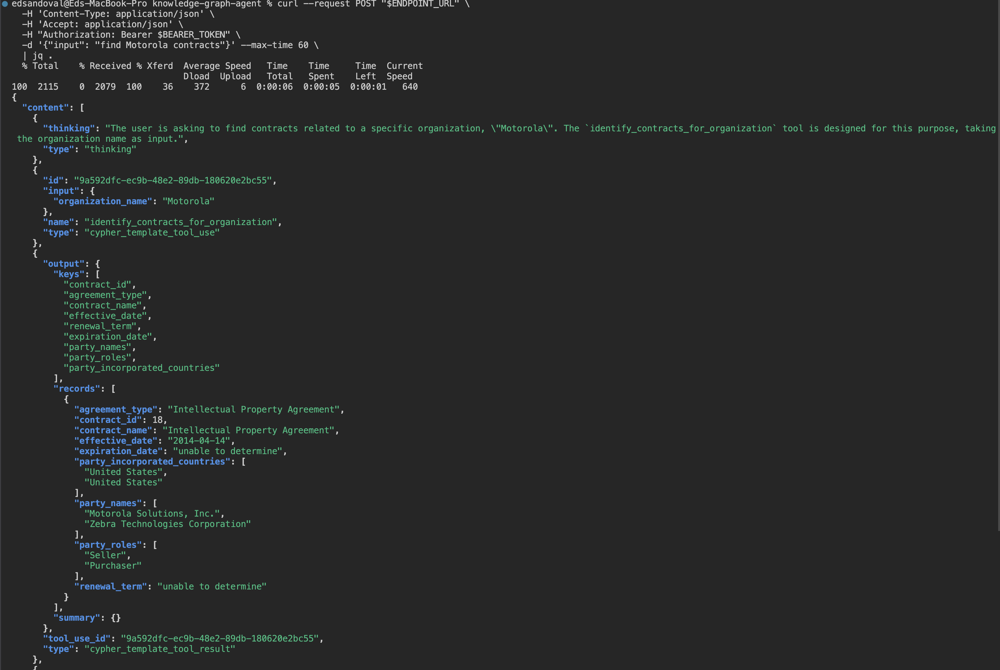

# A Contract Review Agent - Step-by-Step Guide

This guide walks you through creating a Commericial Contract Review agent for legal professionals using Neo4j's Aura Agents. This agent helps analyze contracts, identify key clauses, and assess risks.

## Pre-requisites

1. **Git LFS (Large File Storage)**: This repository contains large backup files that require Git LFS. 
Install Git LFS before cloning:
   ```bash
   # Install Git LFS (if not already installed)
   git lfs install
   
   # Clone the repository
   git clone https://github.com/neo4j-product-examples/knowledge-graph-agent.git
   ```
   
   If you've already cloned without Git LFS, you can fetch the large files by running:
   ```bash
   git lfs pull
   ```

## Step 1: Access Aura Console

1. Navigate to the **Aura Console**: [https://console-preview.neo4j.io/](https://console-preview.neo4j.io/)
2. Log in with your Aura credentials
3. Enable `Generative AI assistance` for your Aura Organization


## Step 2: Set Up The Database
Make sure you have a Neo4j AuraDB instance running. If you're new to AuraDB, create an account at https://console.neo4j.io and click `Create Instance`.

Wait until your instance is `"RUNNING"`


Using the "…​3 dots" menu in the Aura console, select `Backup & Restore`


Restore from `contract-data.backup` which should be under the folder where you clone this repo (See Pre-requisites)

The backup file will be under `./dump/contract-data.backup`

Wait until your instance goes back to `"RUNNING"`

### Allow Tools Authentication to connect to your Instance
- Go back to your Organization -> Security Settings 
- Activate `Allow tools to connect with permissions from the user's project role`
- Make your to select your `Contract DB instance`


## Step 3: Navigate to Agents

Within your Organization, `Open` your Aura project



1. In the Aura Console, locate the **Data Services** section


2. Click on **Agents**

## Step 3: Create Agent

Click on **Create Agent** and enter the following configuration:


### Agent Configuration

**Agent Name:**
```
Contract Review Agent
```

**Description:**
```
A legal contract review agent with access to a Neo4j knowledge graph for analyzing contracts, clauses, and legal risks.
```

**Prompt instructions:**
```
You are a Commercial Contract Review Agent, a specialized AI assistant for commercial contract analysis using a Knowledge Graph of multiple contracts. You are a Neo4j expert with excellent knowledge of Cypher and a paralegal expert who can help junior legal professionals answer important commercial contract review questions.

You have access to a comprehensive knowledge graph containing contract data, clauses. You can query this graph using tools and Cypher to help you get answers.

You can support legal professionals by:
- Identifying high-risk contracts with missing or problematic clauses
- Assessing risk factors and compliance issues across contract portfolios
- Finding contracts with similar clauses or terms for comparative analysis
- Identifying all contracts associated with specific organizations
- Providing paralegal-level guidance on contract review best practices
- Helping junior legal professionals understand complex contractual relationships

Your responses should be professional, accurate, and tailored to help legal professionals make informed decisions.
```

**Target Instance:** Choose your Neo4j instance from the dropdown


## Step 4: Add Tools

Click **Add Tools** configure the following tools:


### Tool 1: Get Contract

Add a `Cypher Template Tool`

**Name**
```
Get Contract
```

**Description:**
```
Given a contract id retrieves information about the agreement including type, name, effective date, expiration date, parties to the contract and country of incorporation of each party
```

**Parameters:**
- Name = `contract_id`. Type = `integer`. Description = `The id of the contract to look up`

**Cypher Query:**
```cypher
MATCH (country:Country)-[i:INCORPORATED_IN]-(p:Organization)-[r:IS_PARTY_TO]-(a:Agreement {contract_id: $contract_id})
WITH a, collect(p.name) as party_names, collect(country.name) as party_incorporated_countries, collect(r.role) as party_roles
RETURN a.contract_id as contract_id, a.agreement_type as agreement_type, a.name as contract_name, a.effective_date as effective_date, a.renewal_term as renewal_term, a.expiration_date as expiration_date, party_names, party_incorporated_countries, party_roles
```



**Click Save**

### Tool 2: Get Contract Clauses

Add a `Cypher Template Tool`

**Name**
```
Get Contract Clauses
```

**Description:**
Given a contract id, it retrieves information about the contract and its clauses, including the clause types and the excerpts from the original contract for each clause type

**Parameters:**
- Name = `contract_id`. Type = `integer`. Description = `The id of the contract`

**Cypher Query:**
```cypher
MATCH (a:Agreement {contract_id: $contract_id})-[:HAS_CLAUSE]->(cc:ContractClause)-[:HAS_EXCERPT]->(e:Excerpt)

With a,cc,e

MATCH (country:Country)-[i:INCORPORATED_IN]-(p:Organization)-[r:IS_PARTY_TO]-(a)

RETURN a.contract_id as contract_id, a.agreement_type as agreement_type, a.name as contract_name, a.effective_date as effective_date, a.renewal_term as renewal_term, a.expiration_date as expiration_date, cc.type as contract_clause_type, collect (p.names) as parties,collect(e.text) as clauses
```


**Click Save**

### Tool 3: Identify Contracts with Similar Text in Clause Excerpts

Add a `Similarity Search Tool`

**Name**
```
Identify Contracts with similar Text in Clause Excerpts
```

**Description:**
```
Given a piece of text, It identifies the most semantically similar clause Excerpts in the system
```

### Embedding Provider Section
**Embedding provider:**
```
Vertex AI
```

**Embedding Model:**
```
gemini-embedding-001
```

### Vector Index Section
**Index Name:**
```
excerpt_embedding
```
**Top K:**
```
5
```

**Click Save**


### Tool 4: Get Contract Info for Excerpt ID

Add a `Cypher Template Tool`

**Name**
```
Get Contract Info for Excerpt ID
```

**Description:**
```
Given a Excerpt ID, it provides details of the contract where that excerpt appears.
```

**Parameters:**
Name
```
excerpt_id
```
Type
```
integer
```
Description
```
The excerpt id to find its related contract.
```

**Cypher Query:**
```cypher
MATCH (e:Excerpt {id: $excerpt_id})<-[:HAS_EXCERPT]-(cc:ContractClause)<-[:HAS_CLAUSE]-(a:Agreement)

WITH a
MATCH (country:Country)-[i:INCORPORATED_IN]-(p:Organization)-[r:IS_PARTY_TO]-(a)

RETURN a.contract_id as contract_id, a.agreement_type as agreement_type, a.name as contract_name, a.effective_date as effective_date, a.renewal_term as renewal_term, a.expiration_date as expiration_date, collect(p.name) as contract_parties
```

**Click Save**

### Tool 5: Tool for system-wide aggregation questions

Add a `Text2Cypher Tool`

**Name**
```
Tool for system-wide aggregation questions
```

**Description:**
```
Use this tool to answer free-form questions that involve aggregation of organizations, contract clauses, clause types, contracts, countries, parties to contracts etc
```

**Click Save**

### Tool 6: Identify Contracts for organization

Add a `Cypher Template Tool`

**Name**
```
Identify Contracts for organization
```

**Description:**
```
Given an organization name, it performs a full-text search on the organization name. It finds the organization with the most similar name and retrieve a list of contracts that the organization is a party of.
```

**Parameters:**
Name
```
organization_name
```
Type
```
string
```
Description
```
The company name to be looked up
```

**Cypher Query:**
```cypher
CALL db.index.fulltext.queryNodes('organizationNameTextIndex', $organization_name)
YIELD node AS o, score
WITH o, score
ORDER BY score DESC
LIMIT 1
//
WITH o
MATCH (o)-[:IS_PARTY_TO]->(a:Agreement)
WITH a
MATCH (country:Country)-[i:INCORPORATED_IN]-(p:Organization)-[r:IS_PARTY_TO]-(a:Agreement)

RETURN a.contract_id as contract_id, a.agreement_type as agreement_type, a.name as contract_name, a.effective_date as effective_date, a.renewal_term as renewal_term, a.expiration_date as expiration_date, collect(p.name) as party_names, collect(r.role) as party_roles, collect(country.name) as party_incorporated_countries
```

**Click Save**

### Tool 7: Identify Contracts With and Without specific clause types

Add a `Cypher Template Tool`

**Name**
```
Identify Contracts With and Without specific clause types
```

**Description:**
```
Identify high-risk contracts that contain a clause of a certain type but do not contain a clause of a different type.
The only possible values for with_clause types and without_clause_type are: "Affiliate License-Licensee","Affiliate License-Licensor","Anti-Assignment","Audit Rights","Cap On Liability","Change Of Control","Competitive Restriction Exception","Covenant Not To Sue","Competitive Restriction Exception","Exclusivity","IP Ownership Assignment","Insurance","Irrevocable Or Perpetual License","Joint IP Ownership","License Grant","Liquidated Damages","Minimum Commitment","No-Solicit Of Customers","No-Solicit Of Employees","Non-Compete","Non-Disparagement","Non-Transferable License","Post-Termination Services","Price Restrictions","Revenue/Profit Sharing","Rofr/Rofo/Rofn","Source Code Escrow","Third Party Beneficiary","Uncapped Liability","Unlimited/All-You-Can-Eat-License","Volume Restriction","Warranty Duration"
```

**Parameters:**
Name
```
with_clause_type
```
Type
```
string
```
Description
```
The contract has this type of clause.
The only possible values for with_clause types are: "Affiliate License-Licensee","Affiliate License-Licensor","Anti-Assignment","Audit Rights","Cap On Liability","Change Of Control","Competitive Restriction Exception","Covenant Not To Sue","Competitive Restriction Exception","Exclusivity","IP Ownership Assignment","Insurance","Irrevocable Or Perpetual License","Joint IP Ownership","License Grant","Liquidated Damages","Minimum Commitment","No-Solicit Of Customers","No-Solicit Of Employees","Non-Compete","Non-Disparagement","Non-Transferable License","Post-Termination Services","Price Restrictions","Revenue/Profit Sharing","Rofr/Rofo/Rofn","Source Code Escrow","Third Party Beneficiary","Uncapped Liability","Unlimited/All-You-Can-Eat-License","Volume Restriction","Warranty Duration"
```

Name
```
without_clause_type
```
Type
```
string
```
Description
```
The contract does not include a clause of this type. 
The only possible values for without_clause_type are: "Affiliate License-Licensee","Affiliate License-Licensor","Anti-Assignment","Audit Rights","Cap On Liability","Change Of Control","Competitive Restriction Exception","Covenant Not To Sue","Competitive Restriction Exception","Exclusivity","IP Ownership Assignment","Insurance","Irrevocable Or Perpetual License","Joint IP Ownership","License Grant","Liquidated Damages","Minimum Commitment","No-Solicit Of Customers","No-Solicit Of Employees","Non-Compete","Non-Disparagement","Non-Transferable License","Post-Termination Services","Price Restrictions","Revenue/Profit Sharing","Rofr/Rofo/Rofn","Source Code Escrow","Third Party Beneficiary","Uncapped Liability","Unlimited/All-You-Can-Eat-License","Volume Restriction","Warranty Duration"
```

**Cypher Query:**
```cypher
MATCH (a:Agreement)-[:HAS_CLAUSE]->(cc_with:ContractClause {type: $with_clause_type})
WHERE NOT EXISTS {
    MATCH (a)-[:HAS_CLAUSE]->(cc_without:ContractClause {type: $without_clause_type})
}
WITH a
MATCH (country:Country)-[i:INCORPORATED_IN]-(p:Organization)-[r:IS_PARTY_TO]-(a)
RETURN a.contract_id as contract_id, a.agreement_type as agreement_type, a.name as contract_name, a.effective_date as effective_date, a.renewal_term as renewal_term, a.expiration_date as expiration_date, collect(p.name) as party_names, collect(r.role) as party_roles, collect(country.name) as party_incorporated_countries
```

**Click Save**


## Save Agent
Once all tools have been configured:

Click **Save Agent** to deploy your Contract Review Agent


## Test Agent

Your Contract Review Agent Agent is now ready to assist you.

Your agent should be able to answer the following lines of questioning

**Question 1**
```
How many contracts, clauses and organizations are there in the system?
```
**Question 2**
```
List the top 5 organizations with the most contracts
```
**Question 3**
```
Find contracts for Netgear
```
**Question 4**
```
For the most recent of these contracts, list their key clauses
```
**Question 5**
```
Suggest ways to improve the license grant clause
```
**Question 6**
```
Find contracts with unlimited liability and no insurance clauses
```
**Question 7**
```
Get information about these contracts including their clauses
```

**Question 8**
```
Find contracts with clauses containing text similar to IP licensing expiration
```
**Question 9**
```
Find details about the Motorola contract, include its clauses
```
**Question 10**
```
highlight the pros and cons of the change of control clause
```

## Make Your Agent Publicly Accessible 

Once you are satisfied with your agent answers, you can make it securely available to your GenAI applications via an API Endpoint.

Go back and edit your agent, make sure you set it to `External`

**Click Save**

Wait 1-2 minutes and your agent now has Public API endpoint

Click `Copy endpoint`


Your agent has an Aura API endpoint.

### Generate Aura API Keys
You will need to generate API keys for an external application to authenticate to your endpoint.

Go to Your Account settings page and locate `API Keys`


Click `Generate API Key`, give it a name and make a note of your new `Client ID` and `Client Secret`

Keep `Client ID and Secret` secure. Do not share.


### Test Your Agent from Terminal
Verify external access by opening a terminal window

Run the following commands
```
export CLIENT_ID=<enter your Client ID here>
export CLIENT_SECRET=<enter your Client Secret here>
export ENDPOINT_URL=<enter your agent endpoint URL>
```

Get an Aura API token
```
export BEARER_TOKEN=$(curl -s --request POST 'https://api.neo4j.io/oauth/token' \
     --user "$CLIENT_ID:$CLIENT_SECRET" \
     --header 'Content-Type: application/x-www-form-urlencoded' \
     --data-urlencode 'grant_type=client_credentials' | jq -r .access_token)
```

Ask your Agent a Question via the agent API endpoint
```
curl --request POST "$ENDPOINT_URL" \
  -H 'Content-Type: application/json' \
  -H 'Accept: application/json' \
  -H "Authorization: Bearer $BEARER_TOKEN" \
  -d '{"input": "find Motorola contracts"}' --max-time 60 \
  | jq .
```

Your agent reply looks like this




