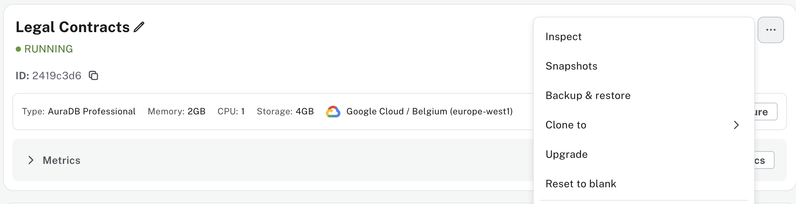
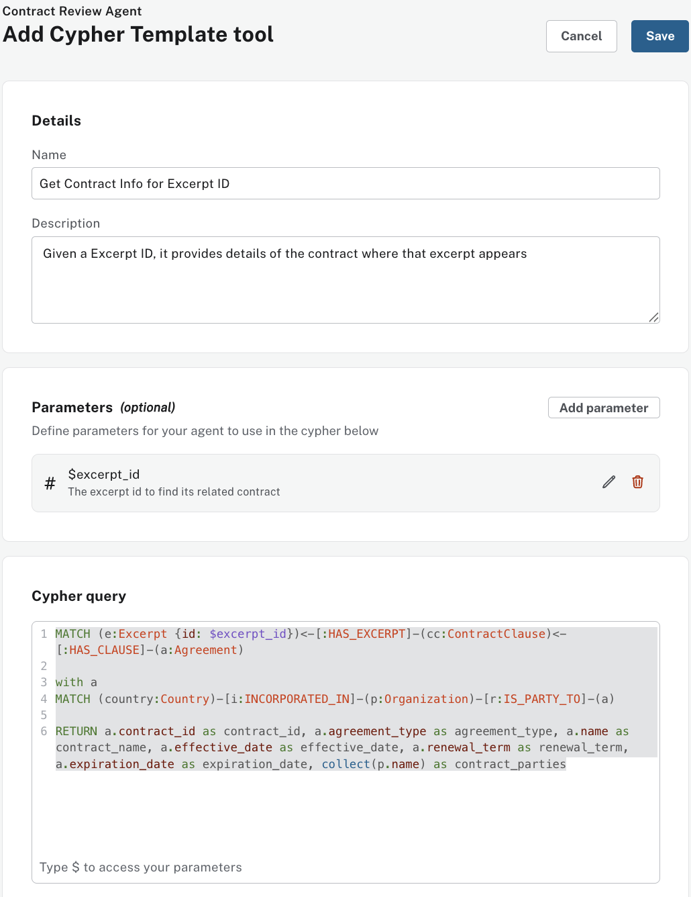
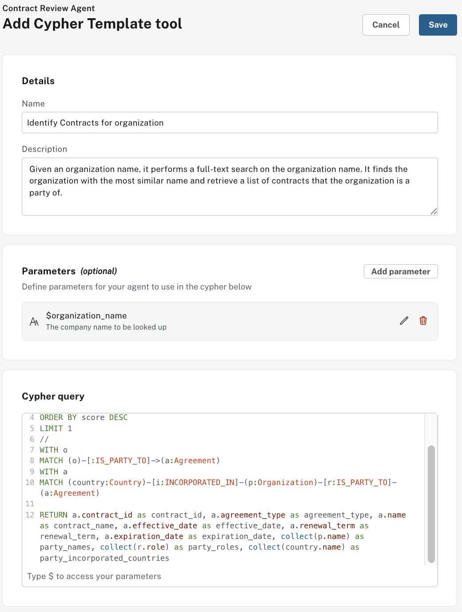
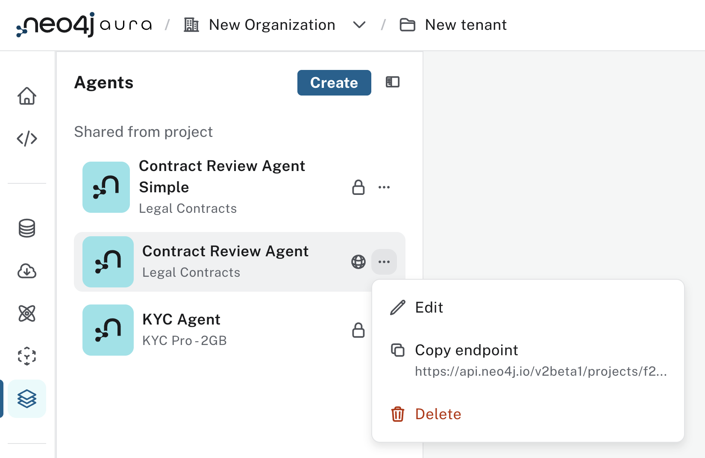

# An Employee Agent - Step-by-Step Guide

This guide walks you through creating an employee agent using the Neo4j Aura Agent. This agent helps with skills analysis, talent search, and team formation.

## Step 1: Access Aura Console

1. Navigate to the **Aura Console**: [https://console-preview.neo4j.io/](https://console-preview.neo4j.io/)
2. Log in with your Aura credentials
3. Enable `Generative AI assistance` for your Aura Organization


## Step 2: Set Up The Database
Make sure you have a Neo4j AuraDB instance running. If you're new to AuraDB, create an account at https://console.neo4j.io and click `Create Instance`.

Wait until your instance is `"RUNNING"`


Using the "…​3 dots" menu in the Aura console, select `Backup & Restore`

Restore from [`contract-data.backup`](./dump/contract-data.backup) file (Located under `./dump/contract-data.backup`)

Wait until your instance goes back to `"RUNNING"`

### Allow Tools Authentication to connect to your Instance
- Go back to your Organization -> Security Settings 
- Activate `Allow tools to connect with permissions from the user's project role`
- Make your to select your `Contract DB instance`


## Step 3: Navigate to Agents

Within your Organization, `Open` your Aura project


1. In the Aura Console, locate the **Data Services** section


2. Click on **Agents**

## Step 3: Create Agent

Click on **Create Agent** and enter the following configuration:


### Agent Configuration

**Agent Name:**
```
Employee Agent
```

**Description:**
```
Conduct skills analysis, talent search, and team formation at Cyberdyne Systems.
```

**Prompt instructions:**
```
This knowledge graph and corresponding tools provide all the information you need to act as a human resources assistant, helping with skills analysis, talent search, and team formation at Cyberdyne Systems.

Corresponding tools retrieve data from internal knowledge on Cyberdyne System employees based on their resumes and profiles.
```

**Target Instance:** Choose your Neo4j instance from the dropdown


## Step 4: Add Tools

Click **Add Tools** configure the following tools:


### Tool 1: Resume Search

Add a `Similarity Search Tool`

**Name**
```
Resume Search
```

**Description:**
```
Search resumes using semantic similarity to identify and retrieve potentially relevant resumes info and associated metadata on the person
```

### Embedding Provider Section
**Embedding provider:**
```
OpenAI
```

**Embedding Model:**
```
text-embedding-ada-002
```

### Vector Index Section
**Index Name:**
```
text_embeddings
```
**Top K:**
```
5
```


**Click Save**

### Tool 2: Query Graph

Add a `Text2Cypher Tool`

**Name**
```
 Query Graph
```

**Description:**
```
Answer aggregation & free-form questions by dynamically querying the knowledge graph
```


**Click Save**

### Tool 3: Find Similar People

Add a `Cypher Template Tool`

**Name**
```
Find Similar People
```

**Description:**
```
This function will return potential similar people to the provided person based on common skill and types and domains of accomplishments.  You can use this as a starting point to find similarities scores. But should use follow up tools and queries to collect more info. Returns a list of person ids for similar candidates order by score which is the count of common skill and types and domains of accomplishments
```

**Parameters:**
Name
```
person_id
```
Type
```
string
```
Description
```
The Id of the person to search for similarities for
```

**Cypher Query:**
```cypher
MATCH p=(p1:Person {id:$personId})--()
         ((:!Person)--() ){0,3}
         (p2:Person)
RETURN count(*) AS score, p2.id AS person_id
ORDER BY score DESC LIMIT 5 //fixing limit at 5 for now
```

**Click Save**

### Tool 4: Find Similarities Between People

Add a `Cypher Template Tool`

**Name**
```
Find Similarities Between People
```

**Description:**
```
This function will return potential similarities between people in the form of skill and accomplishment paths.  You can use this as a starting point to find similarities and query the graph further using the various name fields and person ids. Returns a list of paths between the two people, each path is a compact ascii string representation.  It should reflect the patterns in the graph schema.
```

**Parameters:**
1. Name: `person1_id`, Type: `string`, Description: `The id of the first person to compare`
2. Name: `person2_id`, Type: `string`, Description: `The id of the second person to compare`


**Cypher Query:**
```cypher
MATCH p=(p1:Person {id:$person1_id})--()
         ((:!Person)--() ){0,3}
         (p2:Person{id:$person2_id})
WITH p, nodes(p) as path_nodes, relationships(p) as path_rels, p1, p2
RETURN
  "(" + labels(path_nodes[0])[0] + " {name: \"" + path_nodes[0].name + "\" id: \"" + path_nodes[0].id + "\"})" +
  reduce(chain = "", i IN range(0, size(path_rels)-1) |
    chain +
    "-[" + type(path_rels[i]) + "]-" +
    "(" + labels(path_nodes[i+1])[0] + " {name: " + path_nodes[i+1].name +
    CASE WHEN "Person" IN labels(path_nodes[i+1])
         THEN "\" id: \"" + path_nodes[i+1].id +"\""
         ELSE "\"" END + "})")
```

**Click Save**

### Tool 5: Get Person Resume

Add a `Cypher Template Tool`

**Name**
```
Get Person Resume
```

**Description:**
```
Gets the full resume of a person and their name.
```

**Parameters:**
Name
```
person_id
```
Type
```
string
```
Description
```
The id of the person
```

**Cypher Query:**
```cypher
MATCH (n:Person {id: $person_id})
RETURN n.text as resume, n.name AS name
```

**Click Save**

### Tool 6: Get Person Name

Add a `Cypher Template Tool`

**Name**
```
Get Person Name
```

**Description:**
```
Gets a person name given their id
```

**Parameters:**
Name
```
person_id
```
Type
```
string
```
Description
```
The id of the person
```

**Cypher Query:**
```cypher
MATCH (n:Person {id: $person_id})
RETURN n.name
```

**Click Save**

### Tool 7: Get Person Ids from Name

Add a `Cypher Template Tool`

**Name**
```
Get Person Ids from Name
```

**Description:**
```
Gets all the unique person ids who have the provided name. Note that names aren't guaranteed to be unique so you may get more than one person.
```

**Parameters:**
Name
```
person_name
```
Type
```
string
```
Description
```
The name to lookup person ids with
```

**Cypher Query:**
```cypher
MATCH (n:Person {name: $person_name})
RETURN n.id
```

**Click Save**


## Save Agent
Once all tools have been configured:

Click **Save Agent** to deploy your Employee Agent


## Test Agent

Your Employee Agent is now ready to assist you.

Your agent should be able to answer the following lines of questioning

**Question 1**
```
Which resumes speak to strong AI skills? 
```
**Question 2**
```
 Which people have worked on the most things/projects?
```
**Question 3**
```
Who is most similar to Lucas Martinez and why?
```

## Make Your Agent Publicly Accessible 

Once you are satisfied with your agent answers, you can make it securely available to your GenAI applications via an API Endpoint.

Go back and edit your agent, make sure you set it to `External`

**Click Save**

Wait 1-2 minutes and your agent now has Public API endpoint

Click `Copy endpoint`


Your agent has an Aura API endpoint.

### Generate Aura API Keys
You will need to generate API keys for an external application to authenticate to your endpoint.

Go to Your Account settings page and locate `API Keys`


Click `Generate API Key`, give it a name and make a note of your new `Client ID` and `Client Secret`

Keep `Client ID and Secret` secure. Do not share.


### Test Your Agent from Terminal
Verify external access by opening a terminal window

Run the following commands
```
export CLIENT_ID=<enter your Client ID here>
export CLIENT_SECRET=<enter your Client Secret here>
export ENDPOINT_URL=<enter your agent endpoint URL>
```

Get an Aura API token
```
export BEARER_TOKEN=$(curl -s --request POST 'https://api.neo4j.io/oauth/token' \
     --user "$CLIENT_ID:$CLIENT_SECRET" \
     --header 'Content-Type: application/x-www-form-urlencoded' \
     --data-urlencode 'grant_type=client_credentials' | jq -r .access_token)
```

Ask your Agent a Question via the agent API endpoint
```
curl --request POST "$ENDPOINT_URL" \
  -H 'Content-Type: application/json' \
  -H 'Accept: application/json' \
  -H "Authorization: Bearer $BEARER_TOKEN" \
  -d '{"input": "find Motorola contracts"}' --max-time 60 \
  | jq .
```

Your agent reply looks like this


# Aura Agent MCP Server

## Overview

This is a Local MCP Server for your Neo4j Aura Agent. The [code/aura-agent-mcp/aura-agent-mcp-server.py](code/aura-agent-mcp/aura-agent-mcp-server.py) demonstrates how the agent API endpoint can be wrapped into a local MCP server, making it accessible to Claude Desktop through the Model Context Protocol (MCP).

In the coming weeks, the agent will be available to be made external as a Remote MCP Server. In the meantime, the instructions below show how to create a simple Local MCP server for our agent and test it in Claude.

## Setup Instructions

### Prerequisites
- Python 3.8+
- uv (Python package manager)
- Claude Desktop application

### Steps to Get Started

1. **switch to the `code/aura-agent-mcp/` directory 
    ```bash
    cd code/aura-agent-mcp/
    ```
2. **Install dependencies and create virtual environment**
   ```bash
   uv sync
   ```

3. **Configure environment variables**
   - Copy `.env.example` to `.env`
   - Edit `.env` with your Aura API Key (client and secret) and agent endpoint

4. **Test the server**
   ```bash
   uv run aura-agent-mcp-server.py
   ```
   This will start the MCP server and verify it's working correctly.
   

5. **Add local server to Claude Desktop configuration**
   
   Add the following configuration to your Claude Desktop config JSON file 

   ```json
   {
      "mcpServers": {
        "employee-expert-agent": {
          "command": "uv",
          "args": [
            "--directory",
            "<full_path_to_your_local_repo>knowledge-graph-agent/code/aura-agent-mcp",
            "run",
            "aura-agent-mcp-server.py"
          ]
        }
      }
   }
   ```

6. **\[Optional\] Add Profile** Under `General` in Claude Desktop settings, the following profile can help improve consistency & explainability:
```
When responding:
- Prioritize using expert agents where available and appropriate.
- If your response includes people, include there names and IDs. Never just there Ids.
- You must explain your retrieval logic and where the data came from. You must say exactly how relevance, similarity, etc. was inferred during search.
```

7. **Restart Claude Desktop**
   Close and reopen Claude Desktop to load the new MCP server configuration.
   Go to `Settings -> Developer` and confirm the new MCP server is running

   

8. **Test the integration**
   Ask Claude a question about employees to verify the MCP server is working properly.
   ```
   WHich employees are most similar to Lucas Martinez and why?
   ```
   

## Usage

Once configured, Claude will have access to the agent's capabilities through the MCP server. You can ask questions about contracts, and Claude will use the agent's API endpoints to provide responses.

## Future Development

This local MCP server setup is a temporary solution. In the coming weeks, the agent will be available as a Remote MCP Server, which will simplify the setup process and provide enhanced functionality.


