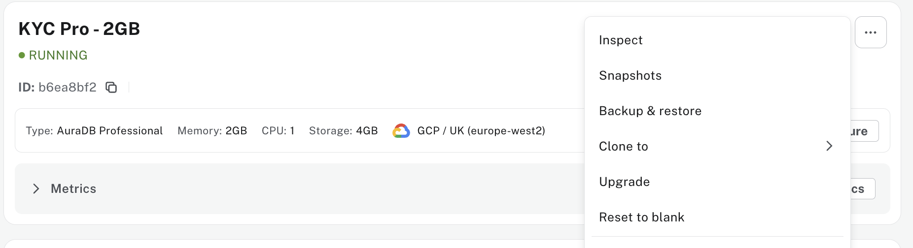

# A KYC Agent - Step-by-Step Guide

This guide walks you through creating a KYC (Know Your Customer) analyst agent using Neo4j's Aura Agents.

## Step 1: Access Aura Console

1. Navigate to the **Aura Console**: [https://console-preview.neo4j.io/](https://console-preview.neo4j.io/)
2. Log in with your Aura credentials
3. Enable `Generative AI assistance` for your Aura Organization


## Step 2: Set Up The Database
Make sure you have a Neo4j AuraDB instance running. If you’re new to AuraDB, create an account at https://console.neo4j.io and click Create Instance.

Wait until your instance is `"RUNNING"`


Using the “…​3 dots” menu in the Aura console, select `Backup & Restore`

Restore from [`kyc-data.backup`](./dump/kyc-data.backup) file (Located under `./dump/kyc-data.backup`)

Wait until your instance goes back to `"RUNNING"`

### Allow Tools Authentication to connect to your Instance
- Go back to your Organization -> Security Settings 
- Activate `Allow tools to connect with permissions from the user's project role`
- Make your to select your `KYC instance`


## Step 3: Navigate to Agents

Within your Organization, `Open` your Aura project


1. In the Aura Console, locate the **Data Services** section


2. Click on ** Agents**

## Step 3: Create Agent

Click on **Create Agent** and enter the following configuration:


### Agent Configuration

**Agent Name:** 
```
KYC Agent
```

**Description:** 
```
A KYC analyst agent with access to a Neo4j knowledge graph.
```

**Instructions:**
```
You are a KYC analyst with access to a knowledge graph. You are also a Neo4j expert and can use the Neo4j MCP server to query the graph. You are capable of answering questions about customers, accounts, their transactions, IP addresses and companies they work for. 
You can also support fraud investigators as they research suspicious activities and patterns.
```

**Target Instance:** Choose your Neo4j instance from the dropdown


Click **Add Tools** and choose `Cypher Template` tool


## Step 4: Add Tools


Configure the following tools:


### Tool 1: Get Customer 

**Name**
```
Get Customer
```

**Description:**  
Given a customer_id, return all information in the Customer node and the name of all Accounts owned by this customer.

**Parameters:**  
- Name = `customer_id`. Type = `string`. Description = `The ID of the customer to look up.`

**Cypher Query:**
```cypher
MATCH (c:Customer {id: $customer_id})-[:OWNS]->(a:Account)
RETURN c.id, c.name, c.on_watchlist, c.is_pep, a.name
```


**Click Save**

---

Repeat the same steps to create the following `Cypher Template` tools

| Tool name | Description | Parameters | Cypher |
|-----------|-------------|------------|--------|
| Get Customer | Given a customer_id, return all information in the Customer node and the name of all Accounts owned by this customer. | customer_id (string) - The ID of the customer to look up. | ```cypher MATCH (c:Customer {id: $customer_id})-[:OWNS]->(a:Account) RETURN c.id, c.name, c.on_watchlist, c.is_pep, a.name``` |
| find_customers_in_rings | Identify high-risk customers involved in circular transaction patterns (up to 6 hops). Detects circular transaction patterns (up to 6 hops) involving high-risk customers. | number_of_customers (int, default: 10) - Maximum number of customers to return | ```cypher MATCH p=(a:Account)-[:FROM\|TO*6]->(a:Account) WITH p, [n IN nodes(p) WHERE n:Account] AS accounts UNWIND accounts AS acct MATCH (cust:Customer)-[r:OWNS]->(acct) WHERE cust.on_watchlist = TRUE OR cust.is_pep = TRUE WITH cust, collect(DISTINCT acct.name) AS accounts_in_ring RETURN cust.name AS customer_name, cust.id AS customer_id, cust.on_watchlist AS customer_on_watchlist, cust.is_pep AS customer_politically_exposed, accounts_in_ring AS customer_accounts_in_ring ORDER BY customer_name ASC LIMIT $number_of_customers``` |
| is_customer_in_ring | Given a customer id, it determines if it is involved in a suspicious ring. | customer_id (string) - The ID of the customer to check. | ```cypher MATCH (c:Customer {id: $customer_id}) WITH c, EXISTS { MATCH (c)-[:OWNS]->(:Account)-[:FROM\|TO*6]->(:Account) } AS involved RETURN involved``` |
| is_customer_bridge | Returns customer details if the customer is employed by more than 2 companies, otherwise returns None. | customer_id (string) - The ID of the customer to check. | ```cypher MATCH (c:Customer {id: $customer_id})-[:EMPLOYED_BY]->(co:Company) WITH collect(co.name) AS employer_names, count(*) AS numEmployers, c WHERE numEmployers > 2 RETURN c.id, c.name, c.on_watchlist, c.is_pep, employer_names``` |
| is_customer_linked_to_hot_property | Check if a customer is linked to a "hot property" (address shared with more than 20 other customers). | customer_id (string) - The ID of the customer to check. | ```cypher MATCH (c:Customer {id: $customer_id})-[:LIVES_AT]->(a:Address) WITH a, c MATCH (a)<-[:LIVES_AT]-(other:Customer) WHERE other <> c WITH a, c, count(other) AS num_other_customers WHERE num_other_customers > 20 RETURN a.name AS address, a.city AS city, num_other_customers, c.name AS customer_name, c.on_watchlist AS customer_on_watchlist, c.is_pep AS customer_is_pep``` |


## Step 5: Save Agent

Once all tools have been configured:

1. Review your agent configuration

Your agent should look like this


2. Click **Save Agent** to deploy your KYC Knowledge Graph Agent


3. Test the agent with sample queries to ensure proper functionality

## Test Your Agent

Your KYC Knowledge Graph Agent is now ready to assist with fraud investigation and compliance analysis!

You can interact with your KYC agent a sequence of questions:

**Question 1**
```
find 10 customers involved in suspicious rings
```
**Question 2**
```
is any of these customers linked to a hot property?
```
**Question 3**
```
find as much as possible about one of these customers linked to a hot property
```
**Question 4**
```
is this customer a bridge?
```
**Question 5**
```
write a 300-word summary with all information you found about this customer
```


